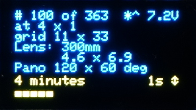
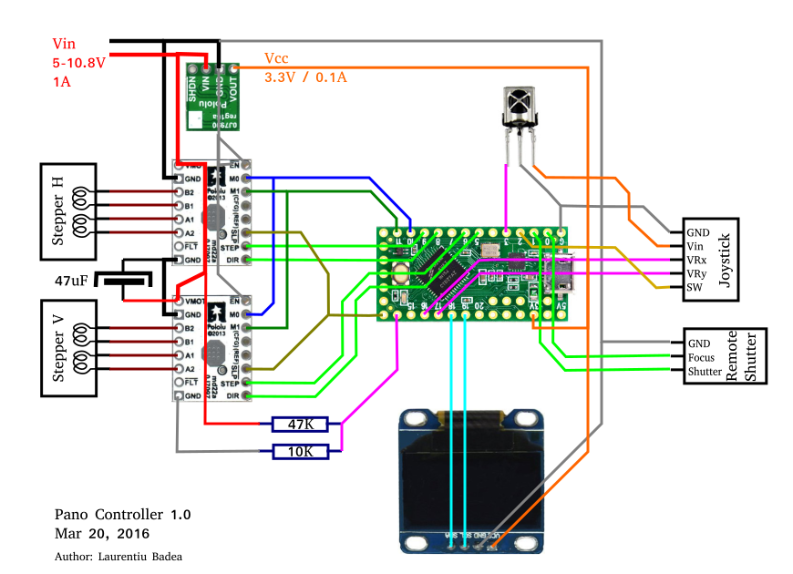

# Pano Controller

Open Arduino-based Platform for high-resolution panoramic photography. 
Started as a board replacement/upgrade for the Gigapan EPIC 100, but designed to be 
flexible and support home-brew panoramic platforms.

See the <a href="https://www.facebook.com/panocontroller">Official Facebook page</a> for demo videos and more progress photos.

Current state: fully functional prototype board, field-tested, frequently upgraded.

## Features:
### Software
- **<a href="https://www.facebook.com/panocontroller/videos/1009260305834819/">Zero-motion shutter delay!</a>**
  When gyro is connected, waits for platform to stabilize before triggering. Useful to compensate for tripod stability, platform's own movement or wind gusts.
- Focal length presets from 12 to 600mm. Precise sub-degree movement control.
- Seamless 360 pano option
- Display:
  - Estimated time left in minutes, taking into account average zero-motion wait time.
  - Battery status
  - Grid size and position
- Precision movement control
- Multiple delay options: pre-shutter and post-shutter, short or long shutter pulse (for bracketing).

### Hardware
- 32-bit ARM controller board
- OLED 128x64 display
- Joystick menu navigation and optional IR remote
- Can operate with battery voltage from 10V down to 6V
- Lower power usage and later voltage cutoff than original Gigapan

## Wiring map

### Teensy LC / 3.x
- A0 - Battery Voltage via divider: Vin---[47K]---A0---[10K]---GND
- A1
- A2 - Joystick Vx
- A3 - Joystick Vy
- A4 - SDA - Display and MPU-6050 board
- A5 - SCL - Display and MPU-6050 board
- A6
- A7
- D0/RX - camera focus (active LOW)
- D1/TX - camera shutter (active LOW)
- D2(int) - Joystick SW
- D3(int) - IR Remote In (AX-1838HS)
- D4
- D5 - StepperV DIR
- D6 - StepperV STEP
- D7 - MPU-6050 INT
- D8 - StepperH DIR
- D9 - StepperH STEP
- D10- M0
- D11- M1
- D12
- D13(led) - ~SLEEP (to both steppers) - LED indicates motors are on

### Other

- All ~EN tied to GND
- All VMOT tied to Vin
- 3.3V step-down adapter from Vin to Vcc

## Notes

- *Atmega328-based boards are not supported*, see issue #57
- IR remote not supported on Adafruit Feather M0, see issue #59
- Settings memory not supported on Feather M0 (no EEPROM)
- Future rewiring plan
  - M0, M1 can be hardwired (M0=Vcc, M1 unconnected for 1:32 mode)
  - DIR should be shared (it is only sampled on STEP)
  - Tie all ~EN together to ground
  - Tie all ~SLEEP together to D13 (LED indicates motors are on)
  - if we ever want to use ESP-12, need to reduce pins. ESP-12 only has 11: 
    (0,2,4,5,12,13,14,15,16,RXD,TXD,ADC)
  - Adafruit Feather M0 BLE uses 4, 7, 8 as Bluefruit RESET, IRQ and CS. 
    Should use same pinout for connecting to external BLE board (SPI).
  - nrf24 library hardcodes pin 13 so if we plan to use it, we'll have to rewire.

## Setting DRV8834 reference

- Vref0 = 2V +- 0.1V
- Pololu schematic shows Risense = 0.1 ohm
- Itrip = Vref/(5*Risense)
- So set Vref = Itrip/2

Gigapan motor spec is 1A, so 0.5V. At full step the current limit is 0.7*Itrip, so
we have to set Itrip to 1.4 and Vref to 0.7V as upper bound.

### Lower current

Tested with ~1.5lb zoom lens+camera. The minimum Vref that avoids skipping is about
0.3V (0.6A to motor), but it will vary with camera weight. It may be possible to use
lower current even, if we reduce the speed.

## Bill of Materials

### Electronics

- Microcontroller, one of below
  - PJRC <a href="http://www.pjrc.com/store/teensylc.html">Teensy LC</a> 
  - PJRC <a href="http://www.pjrc.com/store/teensy32.html">Teensy 3.1+</a>
  - Adafruit <a href="https://learn.adafruit.com/adafruit-feather-m0-basic-proto/">Feather M0</a> (no IR remote)
  - Adafruit <a href="https://learn.adafruit.com/adafruit-feather-m0-bluefruit-le/overview">Feather M0 Bluefruit</a> (no IR remote)
  - (untested but same Cortex M0 as above) <a href="https://www.adafruit.com/products/2843">Arduino Zero</a>
- 2 x <a href="https://www.pololu.com/product/2134">DRV8834 Low-Voltage Stepper Motor Driver</a> from Pololu
- <a href="http://www.amazon.com/Yellow-Serial-128X64-Display-Arduino/dp/B00O2LLT30">128x64 OLED display, SSD1306 I2C</a> from anywhere
- 2-axis + switch analog joystick
- 1834HS IR receiver with some remote - optional but recommended
  - Remote codes are hardcoded in remote.cpp if you have a different remote
- GY-521 board with MPU-6050 6-axis accel/gyro (3.3V version)
- Step-Down 3.3V converter (<a href="https://www.pololu.com/product/2842">Pololu D24V5F3</a>)
- 47uF electrolytic capacitor 
- 10K resistor
- 47K resistor
- 2 x 4-pin female connectors for motor connections
- 3-pin connector/jack for remote shutter
- 2-pin power connector/DC power jack 
- 6AA battery holder or a 6V-10V power source.

### Libraries
- Adafruit_SSD1306
- Adafruit_GFX
- IRremote
- Wire
- <a href="https://github.com/laurb9/StepperDriver/releases">StepperDriver</a>

### Hardware

Well, this is a controller, so it needs a pano bot platform to control. I used the Gigapan
Epic 100 but any platform with two motors (or even one, I suppose) can be used.
The only thing required of the platform is the two horiz/vert stepper motors.

- 2 x <a href="https://www.circuitspecialists.com/stepper-motor">Bipolar Stepper Motors</a> 
  and reduction gears.
  - Examples:
    - 39BYG101 0.5A 
    - 39BYG001 1A (used in Gigapan platform)
  - Notes: 
    - the DRV8834 current limit must be set according to motor spec
    - reduction gear settings are hardcoded in pano.h
