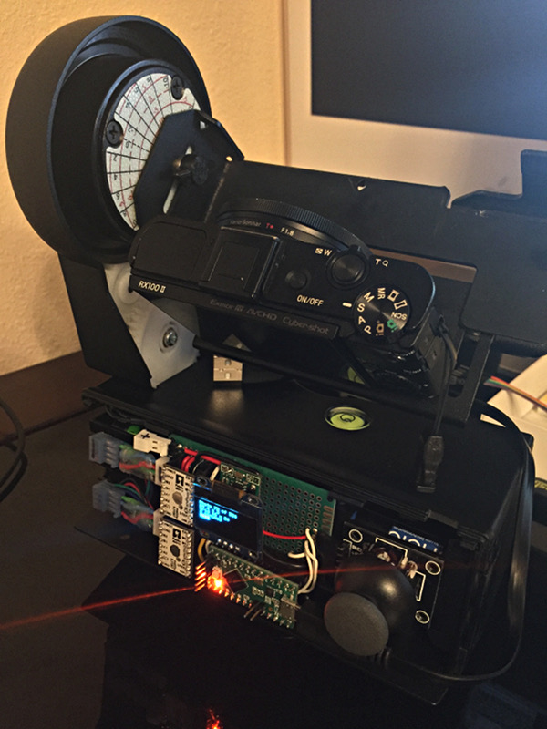
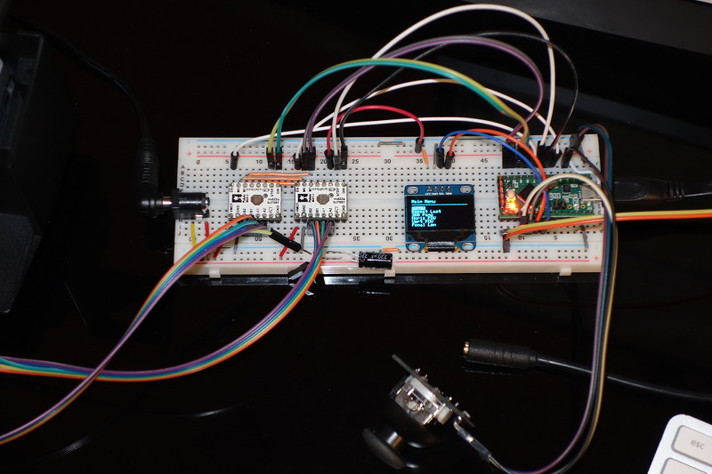

# Pano Controller 2.1

Open Arduino-based Platform for high-resolution panoramic photography controlled via Bluetooth App.
Started as a board replacement/upgrade for the Gigapan EPIC 100, but designed to be 
flexible and support other home-brew panoramic platforms with stepper motor movement.

The design goals for the new versions 2.1 and beyond are as follows:
  1. (iOS) App is required to configure the device and start panorama (the platform cannot set up a pano without it)
  2. (Arduino) Platform can complete a full pano once started, even if App disconnects
  3. (iOS) App may enhance operation during pano execution (by reading status and updating parameters)

See the <a href="https://www.facebook.com/panocontroller">Official Facebook page</a> for demo videos and more progress photos.

Operated over Bluetooth LE via the <a href="https://github.com/laurb9/PanoController">Pano Controller iOS App</a>
or directly via any Bluetooth LE client in UART mode. 

## Features:
### Software
- **<a href="https://www.facebook.com/panocontroller/videos/1009260305834819/">Zero-motion shutter delay!</a>**
  When gyro is connected, waits for platform to stabilize before triggering. 
  Extremely useful feature to compensate for tripod stability, platform's own movement or wind gusts.
- Supports a subset of <a href="g-code.md">G-Code</a> allowing full remote operation of the platform
  via a Bluetooth LE UART link or serial. This enables running other programs than just panoramas 
  (time lapse for example)
- Precision sub-degree movement using the <a href="https://github.com/laurb9/StepperDriver">StepperDriver library</a>
- **<a href="https://www.facebook.com/panocontroller/videos/1488324751261703/">Smooth movement and iOS App Demo (2.1)</a>**

### Hardware
- 32-bit ARM controllers (Gigapan had 8-bit AVR)
- Bluetooth LE control via iOS App
- Battery voltage from 10V down to 6V

## Wiring map

Wiring is still a work in progress. An Adafruit BLE device is now required for Bluetooth LE connectivity.

### Controller

The controller unit comes with no display. All the controls and status are presented via the iOS App.

#### Teensy LC / 3.x

Status: not tested (work in progress)
Bluefruit SPI Friend is required.

- A0 - BATTERY - Battery Voltage via divider: Vin---[47K]---A0---[10K]---GND
- A1
- A2
- A3
- A4 - SDA - MPU-6050 board
- A5 - SCL - MPU-6050 board
- A6
- A7
- D0/RX - CAMERA_FOCUS active LOW
- D1/TX - CAMERA_SHUTTER active LOW
- D2 - MPU-6050 INT
- D3
- D4 - BLUEFRUIT_SPI_RST
- D5 - DIR
- D6 - VERT_STEP
- D7 - BLUEFRUIT_SPI_IRQ
- D8 - BLUEFRUIT_SPI_CS
- D9 - HORIZ_STEP
- D10 - nENABLE
- D11 - SPI_MOSI - BLUEFRUIT
- D12 - SPI_MISO - BLUEFRUIT
- D13 - SPI_SCK - BLUEFRUIT

#### Feather M0 / Bluefruit

Status: in active development. Using onboard Feather/BLE. 
- A0
- A1
- A2
- A3
- A4 - Battery Voltage via divider: Vin---[47K]---A0---[10K]---GND
- A5
- SCK - BLE(internal)
- MOSI - BLE(internal)
- MISO - BLE(internal)
- RX/0 - CAMERA_FOCUS active LOW
- TX/1 - CAMERA_SHUTTER active LOW
- 4[BLE] CS  (internally connected)
- 7[BLE] IRQ (internally connected)
- 8[BLE] RST (internally connected)
- SDA/20 - MPU-6050 board
- SCL/21 - MPU-6050 board
- 5 - DIR
- 6 - VERT_STEP
- 9[A7] - HORIZ_STEP
- 10 - nENABLE
- 11
- 12 - MPU-6050 INT
- 13[LED]

#### All

- Vin is 6-10V
- 3.3V step-down adapter from Vin to Vcc for logic power
- All ~SLEEP tied to Vcc
- All VMOT tied to Vin
- All M1 tied to Vcc      (1:32 mode)
- All M0 left unconnected (1:32 mode)
- All ~ENABLE tied together
- All DIR tied together
- 100uF capacitor at Vin
- 10uF capacitor at Vcc
- 10K pull-up resistor from Vcc to ~ENABLE
- Voltage divider Vin---[47K]---A0---[10K]---GND

## Notes

- *Atmega328-based boards are not supported*, see issue #57
- BLE is required for the current design. Only the Adafruit_BluefruitLE library is supported for now, but any UART-type protocol should work with minimal changes.
- Future rewiring plan
  - if we want to use ESP-12 at some point, need fewer pins. ESP-12 only has 11: 
    (0,2,4,5,12,13,14,15,16,RXD,TXD,ADC)

### Setting stepper motor current limit for DRV8834

- Vref0 = 2V +- 0.1V
- Pololu schematic shows Risense = 0.1 ohm
- Itrip = Vref/(5*Risense)
- So set Vref = Itrip/2

#### Gigapan EPIC 100

Gigapan motor spec is 1A, so 0.5V. At full step the current limit is 0.7*Itrip, so
we have to set Itrip to 1.4 and Vref to 0.7V as upper bound.

#### Lower current

Tested with ~1.5lb zoom lens+camera. The minimum Vref that avoids skipping is about
0.3V (0.6A to motor), but it will vary with camera weight. It may be possible to use
lower current even, if we reduce the speed.

## Bill of Materials

### Electronics

- Microcontroller, one of below
  - Adafruit <a href="https://learn.adafruit.com/adafruit-feather-m0-bluefruit-le/overview">Feather M0 Bluefruit</a>
  - PJRC <a href="http://www.pjrc.com/store/teensylc.html">Teensy LC</a> 
  - PJRC <a href="http://www.pjrc.com/store/teensy32.html">Teensy 3.1+</a>
- 2 x <a href="https://www.pololu.com/product/2134">DRV8834 Low-Voltage Stepper Motor Driver</a> from Pololu.
- (for Teensy) Adafruit <a href="https://learn.adafruit.com/introducing-the-adafruit-bluefruit-spi-breakout">Bluefruit SPI Breakout</a>
- GY-521 board with MPU-6050 6-axis accel/gyro (3.3V version)
- Step-Down 3.3V converter (<a href="https://www.pololu.com/product/2842">Pololu D24V5F3</a>)
- 47uF electrolytic capacitor 
- 10K resistor
- 47K resistor
- 2 x 4-pin female connectors for motor connections
- 3-pin connector/jack for remote shutter
- 2-pin power connector/DC power jack 
- 6AA battery holder or a 6V-10V power source.

### Libraries
- Adafruit_BluefruitLE_SPI
- Wire
- <a href="https://github.com/laurb9/StepperDriver/releases">StepperDriver</a>

### Hardware

Well, this is a controller, so it needs a pano bot platform to control. I used the Gigapan
Epic 100 but any platform with two motors (or even one, I suppose) can be used.
The only thing required of the platform is the two stepper motors, one for horizontal movement 
and the other for vertical.

- 2 x <a href="https://www.circuitspecialists.com/stepper-motor">Bipolar Stepper Motors</a> 
  and reduction gears.
  - Examples:
    - 39BYG101 0.5A 
    - 39BYG001 1A (used in Gigapan platform)
  - Notes: 
    - the DRV8834 current limit must be set according to motor spec
    - reduction gear settings are hardcoded in pano.h

## Previous Versions

The previous versions of this project had different goals and do not require an external app:
- Version 1.4 is a self-contained, standalone controller with joystick, IR remote and 
  optional bluetooth directional pad.
  - https://github.com/laurb9/pano-controller/tree/v1.4
- Version 2.0 is a two-unit (platform and remote control, both Arduino) using 2.4GHz radio
  - https://github.com/laurb9/pano-controller/tree/v2.0-beta

